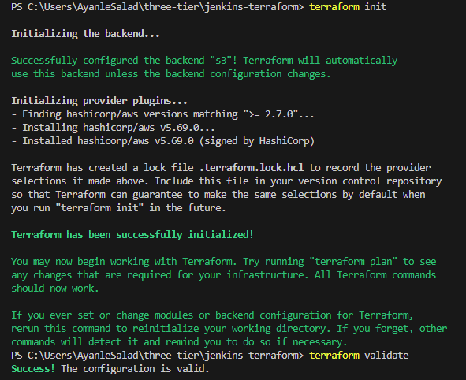
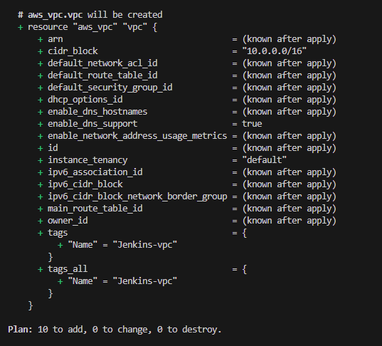
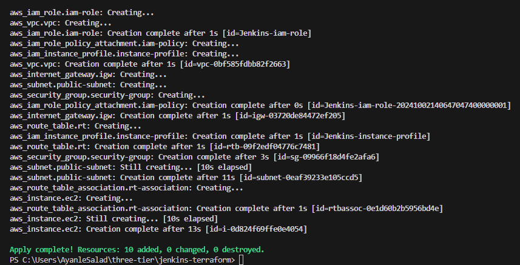
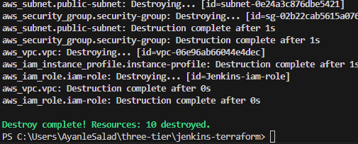
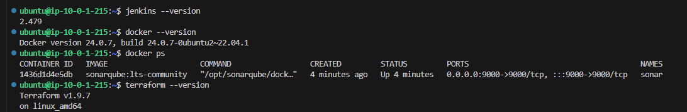
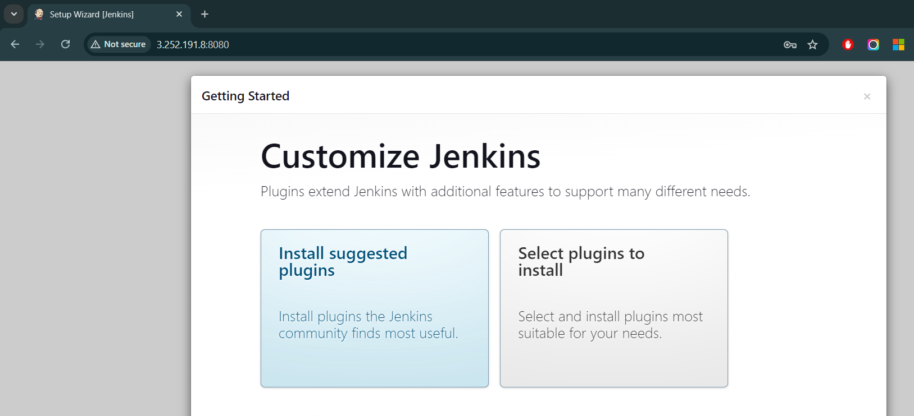
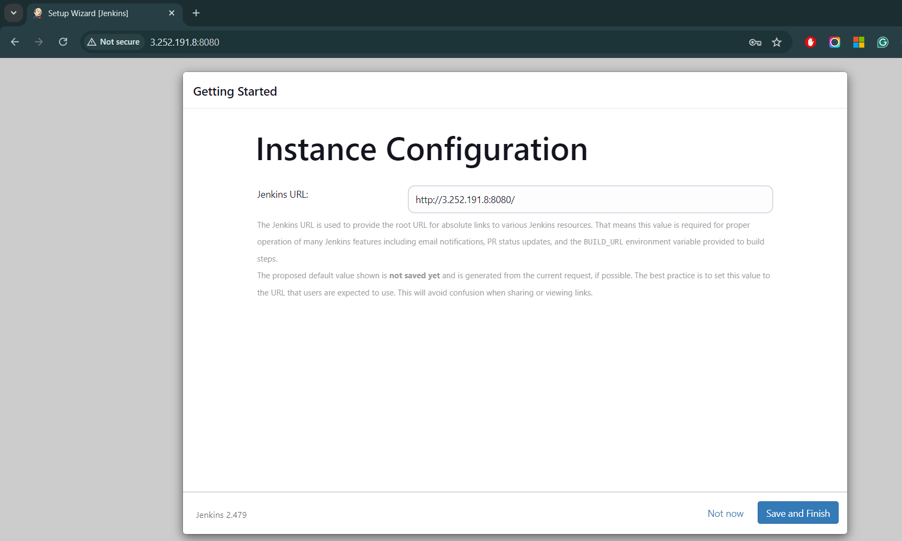

# Three Tier Architecture deployment and monitoring

- Data Layer (Database)
  - db.js handles database connection using Mongoose.
- Application Layer (Backend)
  - index.js sets up a basic Express.js server, connects to the database, exposes routes for creating, updating, deleting and reading tasks and handles http requests.
- Presentation (Frontend)
  - app.js -  React app that displays tasks, allows users to create, delete, and update tasks. App.js component renders the task list, input forms, and buttons, which interact with the backend.


Jenkins setup:

- setup application code
- write out terraform IaC - use this to setup aws infastrcuture which will host application code
- prepare k8 manifest files to deploy backend and frontend
- aws configure
- create dynamodb table for lock files with PK LockID and s3 bucket manually
- terraform init
- terraform validate
- 
- terraform plan -var-file="variables.tfvars"
- 
- create key pair devtf manually
- terraform apply -var-file="variables.tfvars" --auto-approve
- 
- terraform destroy -var-file="variables.tfvars"
- 
- connect to jenkins server

```
Host jenkins-server
    HostName 3.252.191.8
    User ubuntu
    IdentityFile ~/.ssh/devtf.pem

```

- validate user data (tools-install.sh) for ec2 worked by checking if tools are installed on the server.
- Check the user_data log with command `cat /tmp/user_data.log`
- This will output the log of the commands executed during the user data processing. scroll through it to check if any errors occurred during the execution of script.
- jenkins --version, docker --version, docker ps, terraform --version, kubectl version, aws --version, trivy --version, eksctl --version
- 
- Access jenkins server on browser using public ip 3.252.191.8:8080
- sudo cat /var/lib/jenkins/secrets/initialAdminPassword
- 
- 

EKS Set up

- manage plugins > Available plugins > AWS Credentials and Pipeline: AWS Steps. Restart.
- manage plugins > credentials > global > AWS Access Key & Secret Access key + github token
- aws configure
- eksctl create cluster --name Three-Tier-Cluster --region eu-west-1 --node-type t2.medium --nodes-min 2 --nodes-max 2
- aws eks update-kubeconfig --region eu-west-1 --name Three-Tier-Cluster
- kubectl get nodes
- curl -O <https://raw.githubusercontent.com/kubernetes-sigs/aws-load-balancer-controller/v2.5.4/docs/install/iam_policy.json>
- aws iam create-policy --policy-name AWSLoadBalancerControllerIAMPolicy --policy-document file://iam_policy.json
- eksctl utils associate-iam-oidc-provider --region=eu-west-1 --cluster=Three-Tier-Cluster --approve
- eksctl create iamserviceaccount --cluster=Three-Tier-Cluster --namespace=kube-system --name=aws-load-balancer-controller --role-name AmazonEKSLoadBalancerControllerRole --attach-policy-arn=arn:aws:iam::<your_account_id>:policy/AWSLoadBalancerControllerIAMPolicy --approve --region=eu-west-1
- sudo snap install helm --classic
- helm repo add eks <https://aws.github.io/eks-charts>
- helm repo update eks
- helm install aws-load-balancer-controller eks/aws-load-balancer-controller -n kube-system --set clusterName=my-cluster --set serviceAccount.create=false --set serviceAccount.name=aws-load-balancer-controller
- kubectl get deployment -n kube-system aws-load-balancer-controller

ECR Repositories :

- create 2 repositories, one for backend and the other for frontend.
